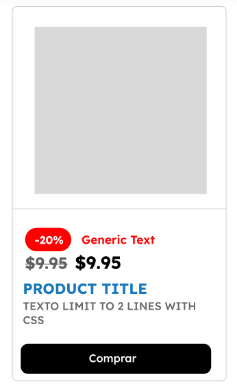
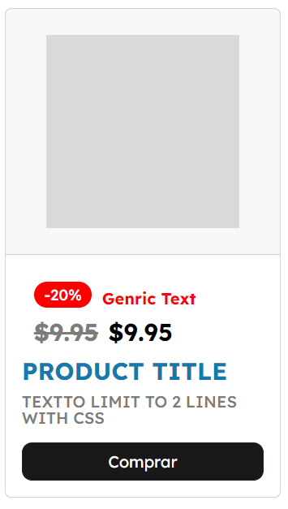

# Creation of CSS and HTML Component (upwork task)

the task was to create an html component that matches the design of the figma file.

the desired outcome and my coding outcome

  
  

This project is licensed under the MIT License - see the [LICENSE](LICENSE) file for details.

Rana (2024)